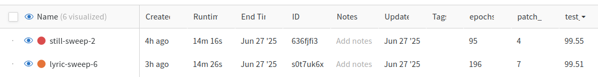

---
# You can also start simply with 'default'
theme: seriph
# random image from a curated Unsplash collection by Anthony
# like them? see https://unsplash.com/collections/94734566/slidev
background: https://plus.unsplash.com/premium_photo-1706838708757-90894d747ada?w=500&auto=format&fit=crop&q=60&ixlib=rb-4.1.0&ixid=M3wxMjA3fDB8MHxjb2xsZWN0aW9uLXBhZ2V8N3w5NDczNDU2Nnx8ZW58MHx8fHx8
# some information about your slides (markdown enabled)
title: Hyperparameter Hippies
info: |
  ## Week 3
# apply unocss classes to the current slide
class: text-center
# https://sli.dev/features/drawing
drawings:
  persist: false
# slide transition: https://sli.dev/guide/animations.html#slide-transitions
transition: slide-left
# enable MDC Syntax: https://sli.dev/features/mdc
mdc: true
# open graph
# seoMeta:
#  ogImage: https://cover.sli.dev
---

# Hyperparameter Hippies

## Week 3

Anton Dergunov, Dan Goss, Ben Liong, Tyrone Nicholas

---
transition: slide-right
---

# What We Built (3x)


---
transition: slide-right
---

# What we built (3x)


---
transition: slide-right
layout: two-cols-header
---

# Lies and the Lying Liars who tell them
::left::

<ul>
<v-click at="1"><li>Profile and tune to make training faster</li></v-click>
<v-click at="3"><li>Refine your model to improve inference</li></v-click>
<v-click at="5"><li>Upgrade to latest libraries</li></v-click>
<v-click at="7"><li>Write parallel code in parallel</li></v-click>
<v-click at="9"><li><code>torch.compile</code> for speed</li></v-click>
<v-click at="11"><li>Academic papers are a clear blueprint to write code</li></v-click>
<v-click at="13"><li>No one gets fired for using PowerPoint / Google Slides</li></v-click>
</ul>
::right::
<ul>
<v-click at="2"><li>Try a new GPU</li></v-click>
<v-click at="4"><li>Modify your training data</li></v-click>
<v-click at="6"><li>Use the preinstalled pytorch</li></v-click>
<v-click at="8"><li>Write it in serial</li></v-click>
<v-click at="10"><li>No</li></v-click>
<v-click at="12"><li>No</li></v-click>
<v-click at="14"><li>Slidev</li></v-click>
</ul>

---
transition: slide-up
level: 2
---

# Demo

<a href="http://localhost:8501" target="_blank">First Demo</a>

---
transition: fade
---

# Anton: Vision to Sequence with Fine-Tuning + [Demo](https://anton-dergunov.github.io/vision_to_sequence/)

<div class="flex">
  <div class="w-1/2 text-xs leading-tight list-disc">

##### Architecture:

- 6 layer encoder & 6 layer decoder
- Embedding dim: 256/8; num heads: 8; MLP dim: 128
- 84x84 images represented as 36 patches
- Training method: teacher forcing; inference method: greedy

<br>

##### Pre-training:

- Train: 80K, Valid: 20K, Test: 20K images (from MNIST dataset)
- 10 epochs, LR=e-4
- Accurracy: 92.75%, Edit Distance: 0.08

<br>

##### Fine-tuning:

- Train: 450, Valid/Test: 50 images (manual annotation)
- 50 epochs, LR=e-5
- Accuracy: 21%, Edit Distance: 1.45

<br>

```
| Correct         | Predicted       |
|-----------------|-----------------|
| [6, 3]          | [6, 3]          |
| [6, 9, 6, 4, 3] | [6, 3, 6, 7, 3] |
| [7, 3, 0, 6, 0] | [7, 7, 9, 6, 0] |
```

  </div>
  <div class="w-1/2 flex justify-end">
    <figure class="text-center">
      
      <figcaption>Data annotation</figcaption>
    </figure>
  </div>
</div>


---
transition: fade
layout: two-cols-header
---

## Get your ViTamins

My vision transformer plateaued hard at 96.7%...

But my straightforward CNN from application project was a strong 99%!

How could I push it over the line?

- Positional encoding
- Dropout
- Layer normalisation (after patching)
- AdamW
- Augmentation
- Sweeps!

<div class="absolute inset-y-0 right-0 flex items-center pr-8">
  
</div>

---

## What's the craic with positional encoding


````python {3-6}
# Fixed sinusoidal positional encoding (original implementation)
pe = torch.zeros(max_len, model_dim)
position = torch.arange(0, max_len, dtype=torch.float).unsqueeze(1)
div_term = torch.exp(torch.arange(0, model_dim, 2) * -(math.log(10_000.0) / model_dim))
broadcast = position * div_term
pe[:, 0::2] = torch.sin(broadcast)
pe[:, 1::2] = torch.cos(broadcast)
pe = pe.unsqueeze(0)  # add batch dimension
self.register_buffer("pe", pe)
````

````python
# or learnable, starting with a truncated normal dist.
self.pe = nn.Parameter(torch.zeros(1, max_len, model_dim))
nn.init.trunc_normal_(self.pe, std=0.02)
````

---

# Adam vs. AdamW


---

# Dimensionality reduction ?!

Can a models with _thousands_ fewer parameters perform as well?


```sh
-rw-r--r--  1 dan dan  16M Jun 26 18:33 simple9899.pth
-rw-rw-r--  1 dan dan  26M Jun 26 18:21 simple9917.pth
```


---

## In the end, all you need is *time*...

(on a big GPU)




