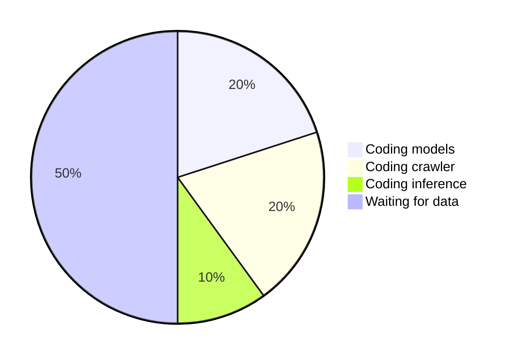

# Time spent this week

---
transition: fade
---

# Lessons Learned

<ul>
<v-click><li>James is a great violin player</li></v-click>
<v-click><li>You should use Network Volumes</li></v-click>
<v-click><li>Crawling goes at a ... crawl</li></v-click>
<v-click><li>Do not underestimate Qwen</li></v-click>
<v-click><li><b>Work backwards</b></li></v-click>
</ul>

---
transition: slide-right
layout: two-cols-header
---

# How to write 2000 LOC that do nothing useful

::left::

<ul>
<v-click at="1"><li><code>precompute_images</code></li></v-click>
<v-click at="2"><li><code>train_models</code></li></v-click>
<v-click at="3"><li><code>train_models --base</code></li></v-click>
<v-click at="4"><li><code>image_puller</code></li></v-click>
<v-click at="5"><li><code>download_open_images</code></li></v-click>
<v-click at="6"><li><code>download_tfds_open</code></li></v-click>
<v-click at="7"><li><code>download_open51</code></li></v-click>
<v-click at="8"><li><code>download_coco</code></li></v-click>
<v-click at="9"><li><code>synthetic_generator</code></li></v-click>
<v-click at="10"><li><code>inference</code></li></v-click>
</ul>

::right::

<ul>
<v-click at="1"><li>Works but takes up to 10 min</li></v-click>
<v-click at="2"><li>Never ran with recent code</li></v-click>
<v-click at="3"><li>Infinite validation loss</li></v-click>
<v-click at="4"><li>Throttled by Wikimedia</li></v-click>
<v-click at="5"><li>Using outdated URLs and got permission errors</li></v-click>
<v-click at="6"><li>Tried to download 27G</li></v-click>
<v-click at="7"><li>Correct, but also throttled</li></v-click>
<v-click at="8"><li>Too slow to upload 9G of data to Computa</li></v-click>
<v-click at="9"><li>Never actually ran</li></v-click>
<v-click at="10"><li>No intact model file matching the code. Just said "A a a a ..." for every image</li></v-click>
</ul>
