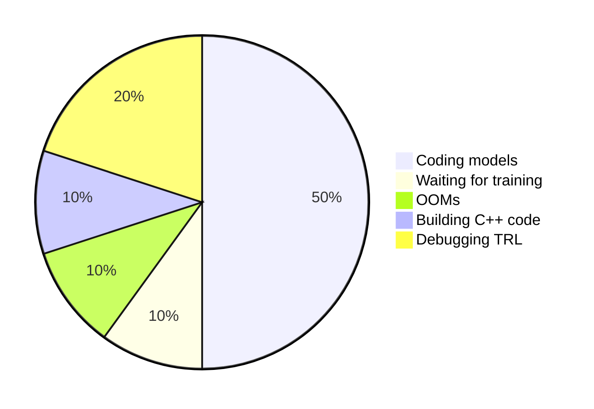
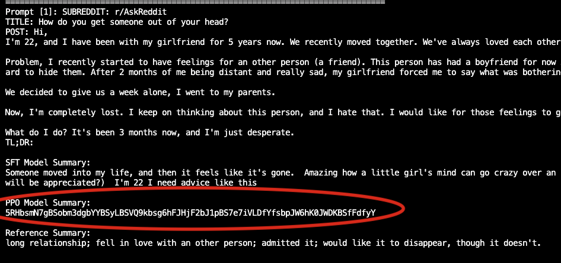
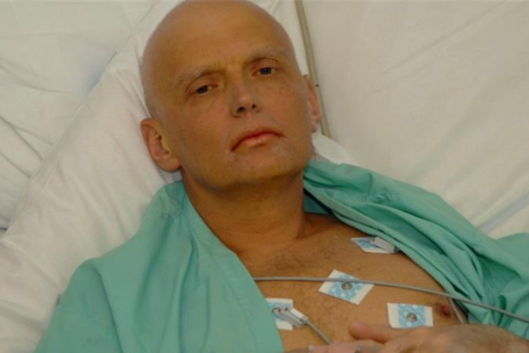
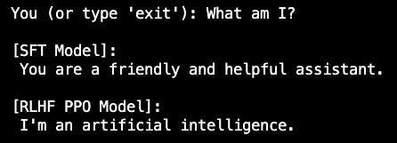
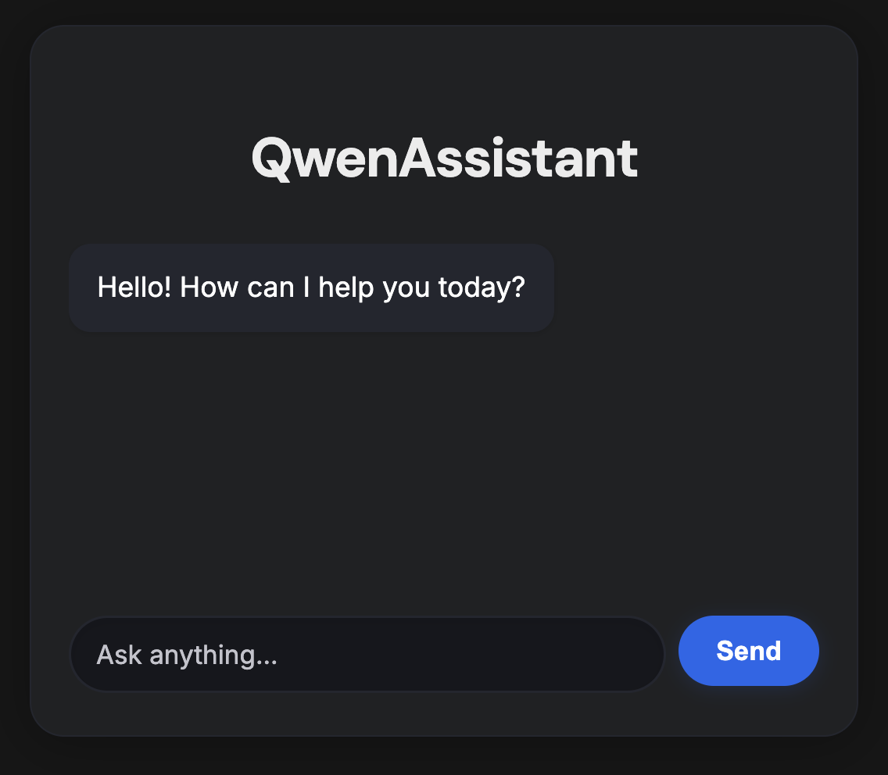
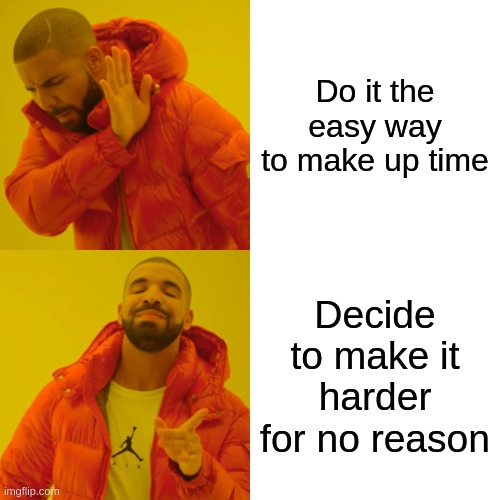
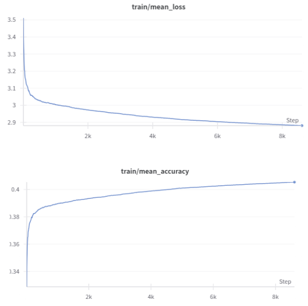
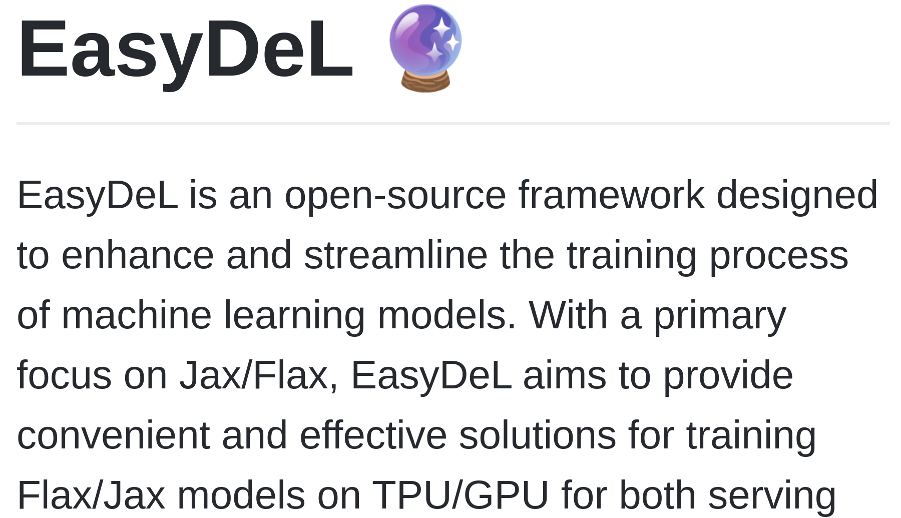
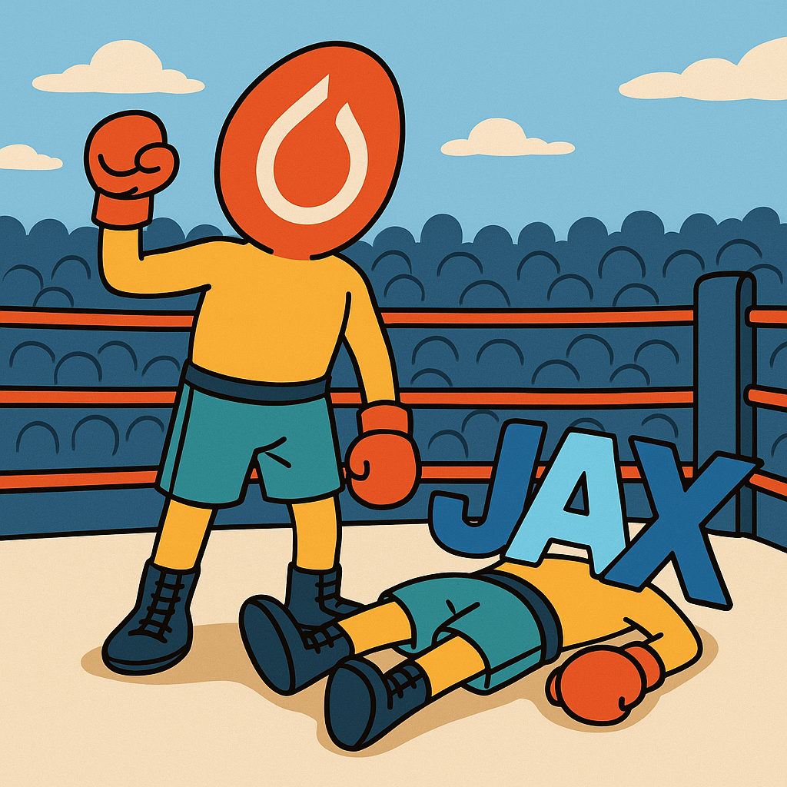

---
# You can also start simply with 'default'
theme: seriph
# random image from a curated Unsplash collection by Anthony
# like them? see https://unsplash.com/collections/94734566/slidev
background: https://cover.sli.dev
# apply unocss classes to the current slide
class: text-center
# https://sli.dev/features/drawing
drawings:
  persist: false
# slide transition: https://sli.dev/guide/animations.html#slide-transitions
transition: slide-left
# enable MDC Syntax: https://sli.dev/features/mdc
mdc: true
# open graph
# seoMeta:
#  ogImage: https://cover.sli.dev
---

# Bayesian Buccaneers

Arjuna James, Tyrone Nicholas, Ben Williams

---
transition: slide-left
---

# Time Spent This Week

---
transition: slide-left
---

# Money Spent This Week

---
transition: slide-left
---

# Things I Learned This Week

<ul>
<v-click><li>There's a another room at the bottom of the fire escape</li></v-click>
<v-click><li>TRL kind of sucks</li></v-click>
<v-click><li>Prompts matter</li></v-click>
<v-click><li>Warmup and learning rate are decisive</li></v-click>
<v-click><li>Use less data</li></v-click>
</ul>

---
transition: slide-left
---

# Demo

https://ujt5b5x9f0hsw6-7860.proxy.runpod.net/

---
transition: slide-left
---

# ChatGPT + PPO: How It Started...

---
transition: slide-left
---

# After 2 Hours of Debugging...

---
transition: slide-left
---

# After 4 Hours of Debugging...

---
transition: slide-left
---

# After 6 Hours of Debugging...

---
transition: slide-left
---

# How It Ended

---
transition: slide-left
---

---
transition: slide-left
---

---
transition: slide-left
---

<h1 style="font-size:2rem;">
  <a href="http://65.109.84.92:7000/" target="_blank">🇨🇳 Str8 Outta China</a>
</h1>

---
transition: slide-left
---

# Week 6 – Hard mode

- Two days lost to induction
- Another half‑day on admin

---
transition: slide-left
---

# JAX

- Decided to spend the week learning JAX for the very first time
- Why the hype?
- Main goal: fine‑tune GPT‑2 with LoRA on my laptop GPU

---
transition: slide-left
---

# What I Achieved in my 2.5 days

- Loaded GPT‑2 with Flax (small enough for my GPU)
- Got it training at a low learning rate
- LoRA integration = package pain
- Finally got LoRA working – loss ⬇️, accuracy ⬆️

---
transition: slide-left
---

# JAX vs PyTorch

- JAX pre‑compiles graphs vs PyTorch rebuilds the graph on every forward pass 
- JAX parallelises across devices automatically (untested)
- JAX is more “functional” – you need wrappers:  
  - **Flax** for NN modules  
  - **Optax** for optimisers  
- No PEFT‑style library, so I used **EasyDeL** (which was not 'Easy')

---
transition: slide-left
---

# Lessons Learned

- JAX is way more effort than its worth for most use cases 
- Docs aren't good
- "JAX is blazingly fast once it’s working"
- Will I carry on with it? Probably not in the near term

---
transition: slide-left
---

# Humble brag

  

    <ul>
      <li>No.10</li>
      <li>MLX plug</li>
    </ul>
    
  

  

    <video src="./images/ben_vid.mp4" autoplay loop muted playsinline class="w-full h-auto"></video>
  

